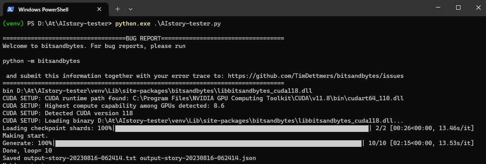

# AIstory-tester

[AIBunCho 様](https://huggingface.co/AIBunCho/japanese-novel-gpt-j-6b)
が公開された小説特化型 LLM モデル「AIBunCho/japanese-novel-gpt-j-6b」をあれこれ試すためのテストコードです。

# 要件

実行には Windows ＆ NVIDIA 環境が必須で、VRAM は(4bit 量子化しても)最低 8GB 必要です。

※8/17 Linux/wsl にも仮対応しました。wsl では動作確認まで完了していますが、Linux の確認はまだ取れていません。（多分今回の修正で動くはず）

# インストール手順

Python の実行環境と CUDA ドライバは事前に導入しておいてください。

1.適当なフォルダを作成し、PowerShell 等から次のコマンドを実行してください。

```
pip install -r requirements.txt
```

# 実行

```
python.exe .\AIstory-tester.py
```

しばらくすると「output-story-20230815-235959.txt」みたいのが同じフォルダ内に生成されます。実行するたびに生成内容はランダムに変化しますので、まずはお楽しみください。

※最初の実行はモデルのダウンロード等でかなり時間がかかると思います。ご了承ください。

# ヒント

現状で各種設定は「sample.json」に格納しています。

```json:sample.json
{
  "指示": "",
  "設定": "",
  "状況": "",
  "あらすじ": "",
  "文章": "",
  "シード": -1,
  "modelsize": 4,
  "max_new_tokens": 65535,
  "temperature": 0.7,
  "top_p": 0.9,
  "repetition_penalty": 1.2,
  "maxloop": 10,
  "maxlength": 1500,
  "maxwait": 5,
  "end": 0
}
```

このうち
"指示",
"設定",
"状況",
"あらすじ",
"文章",
にそれぞれ適当な編集を行い実行すると出力結果が変化します。残念ながら作者にも最適な指示はわからないので、もしおもしろい指示や設定を見つけた方は何らかの方法で共有して頂けるとうれしいです。

# ToDo

- LoRA でチューニング

# ライセンス

MIT

# 謝意

- すばらしいモデルを公開された AI BunCho 様に改めて感謝いたします。

- [「AI Buncho モデルで何か物語めいたものを生成する」](https://note.com/shi3zblog/n/n0eb77bae5a8a) shi3z 様の note 記事が大変参考になりました。
